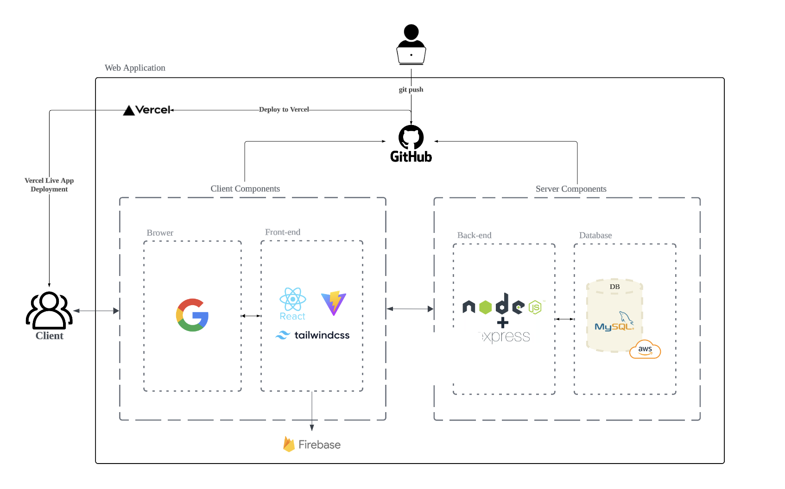

<h1 align=center> 🐶 Moongchee Client 🐶 </h1>
<div align=center>
🐶뭉치🐶는 반려동물 용품 쇼핑과 펫시터 예약 서비스를 한 곳에서 제공하는 스마트 종합 케어 플랫폼입니다. <br/>바쁜 반려인을 위한 편리한 반려동물 라이프를 제안합니다.
</div>

##


**Server Repo**: [Moongchee Server](https://github.com/URECA-TEAM3/moongchee-server)

## 목차

- [](#)
- [목차](#목차)
- [📄 개요](#-개요)
- [✏️ 프로젝트 설명](#️-프로젝트-설명)
- [👥 팀원 소개](#-팀원-소개)
- [📌 주요 서비스](#-주요-서비스)
- [⚙️ Project Architecture](#️-project-architecture)
- [🔨 Tech Stack](#-tech-stack)
- [🖥️ Project Setup](#️-project-setup)
  - [**Prerequisites**](#prerequisites)
  - [**Installation**](#installation)

## 📄 개요

- 프로젝트 이름: Moongchee 🏠
- 프로젝트 개발기간: 2024.10.00-2024.11.08
- 멤버: 팀 강서진, 김예원, 김의진, 김주영, 노승희, 박주광

## ✏️ 프로젝트 설명

**뭉치**는 프로젝트는 바쁜 일상 속에서도 반려동물을 사랑하는 현대인들을 위한 스마트한 반려동물 종합 케어 플랫폼입니다. 반려동물 용품 쇼핑몰과 검증된 펫시터 예약 서비스가 결합되어, 반려인들이 필요한 모든 서비스를 한 번에 이용할 수 있도록 돕습니다. 이제 반려동물 돌봄과 쇼핑을 한 곳에서 간편하게 해결할 수 있는 뭉치와 함께, 더 편리하고 즐거운 반려동물 라이프를 만나보세요!

## 👥 팀원 소개

|            |      |  |
| :------------------------------------------------------------------------------------: | :-----------------------------------------------------------------------------: | :---------------------------------------------------------------------------: |
|                 강서진<br/>[@skang9810](https://github.com/skang9810)                  |              김예원<br/>[@yewoniiii](https://github.com/yewoniiii)              |               김의진<br/>[@Eu1j1n](hhttps://github.com/Eu1j1n)                |
|  |  |     |
|                     김주영<br/>[@ju892](https://github.com/ju892)                      |             노승희<br/>[@seung-heee](https://github.com/seung-heee)             |               박주광<br/>[@jugpark](https://github.com/jugpark)               |

<!-- |||||||
|강서진<br/>[@skang9810](https://github.com/skang9810)|김예원<br/>[@yewoniiii](https://github.com/yewoniiii)|김의진<br/>[@Eu1j1n](https://github.com/Eu1j1n)|김주영<br/>[@ju892](https://github.com/ju892)|노승희<br/>[@seung-heee](https://github.com/seung-heee)|박주광<br/>[@git](https://github.com/git)|
 -->

## 📌 주요 서비스

1. **회원 관리 및 로그인**
   - 소셜 로그인 (Google, Kakao)
   - 회원 가입 및 로그인
2. **쇼핑몰 서비스**
   - 반려동물 용품 조회 및 구매
   - 장바구니 및 결제 기능
   - 포인트 적립 및 사용
3. **펫시터 예약 서비스**
   - 펫시터 추천 및 예약
   - 펫시터 프로필 조회
   - 예약 취소 및 내역 조회
4. **알림 기능**
   - 펫시터 예약 신청, 수락, 취소 알림 제공
5. **기타**
   - 사용자 인터페이스 (UI) 및 사용자 경험 (UX) 최적화
   - 모바일 및 데스크탑 지원

## ⚙️ Project Architecture



## 🔨 Tech Stack

- **Frontend**: Vite, React.js
- **State Management**: Zustand
- **UI Framework**: Tailwind CSS
- **Date Picker**: React Date Picker
- **Notification UI**: React Hot Toast
- **Deployment**: Vercel

## 🖥️ Project Setup

### **Prerequisites**

- **Node.js**
- **npm** (or **yarn**)

### **Installation**

1. **Clone the Repository**

   ```bash
   git clone https://github.com/URECA-TEAM3/moongchee-client.git
   cd moongchee-client
   ```

2. Install Dependencies
   ```bash
   npm install (or npm i)
   ```
3. Set Up Environment Variables

   Please contact one of our members to obtain the variables

4. Start the Server
   ```bash
   npm run dev
   ```
   The server should now be running at http://localhost:5173
